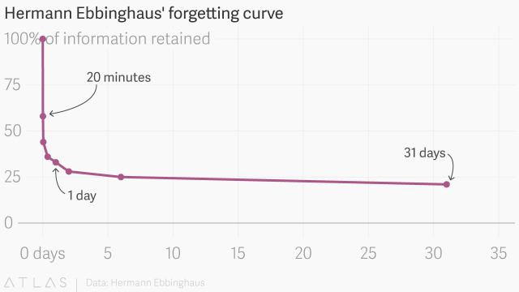

[`mx-psi.github.io/studying`](https://mx-psi.github.io/studying)

## ¿Cómo estudiar mejor?

- Hay muchos factores que no podemos o sabemos controlar
- [Correlación no implica causalidad](https://en.wikipedia.org/wiki/Correlation_does_not_imply_causation) (¡a veces sí!)
- No soy un experto

<aside class="notes">
Algunos aspectos que actualmente no sabemos cómo controlar y que afectan a tu rendimiento:

- Estatus socioeconómico: cómo de rico seas y cómo de favorable sea tu entorno
- IQ, capacidad de memoria de trabajo, impulsividad y otros factores con un componente genético importante
- Profesores y sistema educativo
- Discapacidad y enfermedad
</aside>

# Mejorar productividad

## Sueño y nutrición

Dormir y tener una alimentación adecuada es importante!!
[[1]](https://www.sciencedirect.com/science/article/pii/S1087079205001231), [[2]](https://www.ncbi.nlm.nih.gov/pubmed/28515433), [[3]](https://www.webmd.com/sleep-disorders/sleep-deprivation-effects-on-memory)

## Gestión del tiempo

Las técnicas de gestión del tiempo no tienen una relación clara con el rendimiento académico.
Sí tienen efectos positivos en la reducción del estrés y la satisfacción en el trabajo.[[1]](http://citeseerx.ist.psu.edu/viewdoc/download?doi=10.1.1.466.4966&rep=rep1&type=pdf)

***

Algunas cosas que parecen ayudar:

- **Anotar** las cosas que tienes que hacer
- Establecer **objetivos** de estudio: qué, cuándo, cuánto tiempo (y [seguirlos](https://www.lesswrong.com/posts/RWo4LwFzpHNQCTcYt/how-to-beat-procrastination)!).
- **Priorizar** las tareas

<aside class="notes">
- org-mode, Taskwarrior, Asana, bullet journals?
- Desarrollar hábitos (Beeminder, ¿Pavlok?)
- No hay evidencia de qué técnicas específicas (GTD, Kanban... sean más eficientes)
</aside>

## ¿[Nootrópicos](https://www.gwern.net/Nootropics)?

- Efectos mucho menores que las técnicas de estudio efectivas
- Muchos son sustancias adictivas, ilegales o poco estudiadas
- El café parece estar bien

***

Si aún así quieres probarlos:

Toma [dosis pequeñas](http://drugs.tripsit.me/category/nootropic), [infórmate](https://darktka.github.io/) y [ten cuidado](http://slatestarcodex.com/2017/08/10/brief-cautionary-notes-on-branded-combination-nootropics/)

**Aviso legal**: LibreIM no se hace responsable de qué hagas con esta información. Nada en esta presentación debe ser entendido como un consejo médico o como promoción de sustancias ilícitas. Pórtate bien.

# Técnicas de estudio

## Poco útiles

Resumir
: Lleva mucho tiempo. Poca evidencia. Mejor intentarlo de memoria. [[1]](http://www.indiana.edu/~pcl/rgoldsto/courses/dunloskyimprovinglearning.pdf),[[2]](https://www.tandfonline.com/doi/abs/10.1080/09658210802647009)

Subrayar
: Contraproducente si lo haces mal. [[1]](https://www.ncbi.nlm.nih.gov/pubmed/19650523)

Releer
: Poco útil en comparación con otras técnicas. [[1]](http://www.indiana.edu/~pcl/rgoldsto/courses/dunloskyimprovinglearning.pdf)

<aside class="notes">
Ojo, salvo subrayado si lo haces mal tienen efectos positivos en general pero son menos efectivas.
</aside>

## Más útiles

1. Repetición espaciada
2. *Retrieval practice*
3. Elaboración
4. Práctica intercalada
5. Ejemplos concretos
6. Codificación dual

Me centro en las dos primeras.

Lee sobre el resto [aquí](http://www.learningscientists.org/s/Spanish-Six-Strategies-for-Effective-Learning-posters-cw5g.pdf).

<aside class="notes">
Los he puesto en inglés porque no sé los nombres en español y es más fácil encontrar información con ese nombre.
</aside>

# [Repetición espaciada](https://codual.github.io/2016/07/07/repeticion-espaciada/)

## Qué es

Distancias las sesiones de estudio de un mismo tema.

Intentas recordar algo justo cuando lo vas a olvidar.

## Cómo usarlo

- Lo más popular: *flashcards* con [una aplicación](https://en.wikipedia.org/wiki/List_of_flashcard_software)
- Yo uso [Anki](https://apps.ankiweb.net/). Es libre, y es gratuita para Windows, macOS, GNU/Linux y Android
- La aplicación se encarga de gestionar el momento óptimo para volverte a preguntar

<aside class="notes">
En iOS es de pago, pero podéis usar Ankiweb.
</aside>

***

En Android: [Ankidroid](https://f-droid.org/en/packages/com.ichi2.anki/).

[Ankiweb](https://ankiweb.net/about) es un servicio gratuito para sincronizar las tarjetas.

Las tarjetas se dividen en mazos y tienen distintos tipos: básico, cloze, invertidas.

<aside class="notes">
Podéis usar un servidor libre si lo preferís (en la descripción de AnkiDroid de F-Droid está).
</aside>

***

Algunos [consejos](https://www.supermemo.com/en/articles/20rules):

- Comprende antes de intentar memorizar
- Utiliza el tipo de tarjeta adecuado
- Incluye todo el contexto
- Divide la información
- Evita "dar pistas"
- Evita ambigüedades

## Cuándo usarlo

- Puedes dividir el conocimiento en unidades pequeñas
- Tienes al menos **5 días** (cuanto más tiempo mejor)
- Tienes un momento fijo del día para hacerlo (p. ej.: transporte público)

## Matemáticas

- Haz una tarjeta por proposición, definición, teorema.
- `\(e^{i\tau}\)`    →    $e^{i\tau}$ (`Ctrl`+`M`,`E`).
- Puedes usar mazos ya hechos: [`mx-psi/anki`](https://github.com/mx-psi/anki).
- Si editas en el móvil, utiliza [AnkiEditor](https://f-droid.org/en/packages/com.jkcarino.ankieditor/).

<aside class="notes">
Esta versión sólo funciona a partir de Anki 2.1 y AnkiDroid 2.9.

Para versiones anteriores hay que utilizar `dvipng` y generarlos en el ordenador
</aside>

# Fin

## Enlaces

- [Repetición espaciada: consejos](https://codual.github.io/2016/07/07/repeticion-espaciada/)
- [*A review of the time management literature*](http://citeseerx.ist.psu.edu/viewdoc/download?doi=10.1.1.466.4966&rep=rep1&type=pdf)
- [*The Learning Scientists*](http://www.learningscientists.org/downloadable-materials)
- [*Learning About Learning Report*](http://www.nctq.org/dmsView/Learning_About_Learning_Report)
- [*Improving learning*](http://www.indiana.edu/~pcl/rgoldsto/courses/dunloskyimprovinglearning.pdf)
- [*Optimizing Learning in College: Tips From Cognitive Psychology*](http://pps.sagepub.com/content/11/5/652.full.pdf)
- [*Learning how to learn*](https://www.coursera.org/learn/learning-how-to-learn)
- Mi Pinboard: [*'education'*](https://pinboard.in/u:mx_psi/t:education) y [*'learning'*](https://pinboard.in/u:mx_psi/t:learning)

